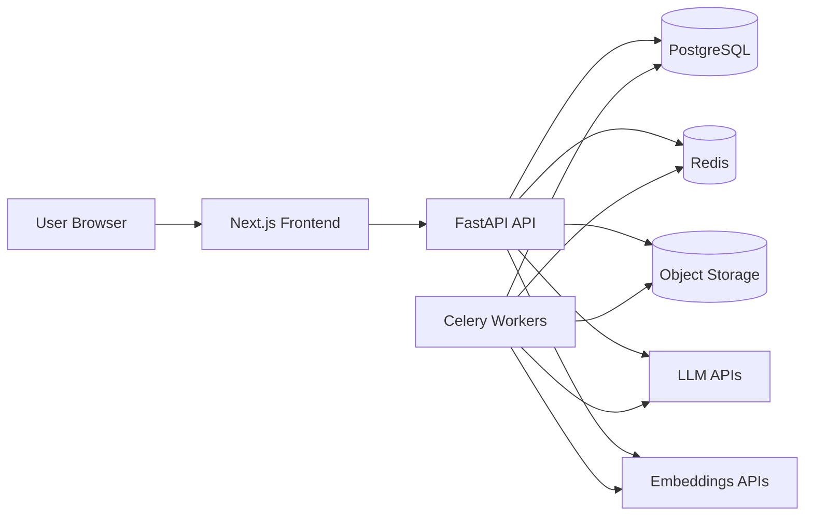

# BuildPilot AI Foundation

## 1. Final Architecture

BuildPilot AI will ship as a two-application SaaS platform with supporting data and asynchronous processing layers:

- Frontend: `Next.js` App Router, `TypeScript`, `Tailwind CSS`, `shadcn/ui`, `Framer Motion`, `Recharts`
- Backend API: `FastAPI`, `Pydantic`, `SQLAlchemy`, `Alembic`
- Primary database: `PostgreSQL`
- Vector search: `pgvector` in PostgreSQL
- Cache and queue broker: `Redis`
- Background jobs: `Celery`
- File storage: S3-compatible object storage
- AI providers: LLM and embeddings APIs through a dedicated AI orchestration layer

### High-level Runtime Shape



### Architectural Principles

- Keep the frontend focused on user experience, rendering, and typed API consumption.
- Keep the backend responsible for business rules, security, persistence, AI orchestration, and access control.
- Treat AI output as untrusted input until validated against explicit schemas.
- Use asynchronous jobs for long-running AI generation, scoring, and document ingestion.
- Keep user and project data isolated at the database and query level.

## 2. Repository Structure

```text
buildpilot-ai/
├── backend/
│   ├── app/
│   │   ├── ai/
│   │   ├── api/
│   │   │   └── v1/
│   │   │       └── endpoints/
│   │   ├── core/
│   │   ├── database/
│   │   ├── models/
│   │   ├── rag/
│   │   ├── repositories/
│   │   ├── schemas/
│   │   ├── services/
│   │   └── utils/
│   ├── tests/
│   └── pyproject.toml
├── docs/
│   └── architecture/
├── frontend/
│   ├── public/
│   └── src/
│       ├── app/
│       ├── components/
│       ├── lib/
│       └── types/
├── infra/
├── .env.example
├── Makefile
├── package.json
└── pnpm-workspace.yaml
```

### Why this shape

- `backend/` is opinionated for domain layering and future testability.
- `frontend/` is optimized for App Router, feature growth, and typed API integration.
- `docs/` holds architecture, API, prompts, and delivery decisions in version control.
- `infra/` will later hold deployment and environment automation without polluting application code.

## 3. Database Strategy

The platform will use a normalized PostgreSQL schema as the source of truth for application state.

### Core data decisions

- Every major record is scoped by `user_id`, `project_id`, or both.
- Multi-user collaboration uses `project_members`.
- AI-generated artifacts are stored as first-class records rather than transient blobs.
- Documents are stored in object storage, while extracted text, metadata, and embeddings are stored in PostgreSQL.
- Vector embeddings live in `document_chunks.embedding` using `pgvector`.

### Planned data domains

- Identity: `users`, `sessions`, `email_verifications`, `password_resets`
- Projects: `projects`, `project_members`, `project_scores`, `project_analyses`
- Delivery: `tasks`, `roadmaps`, `activity_logs`, `notifications`
- Knowledge: `documents`, `document_chunks`
- AI: `ai_conversations`, `ai_messages`

### Query strategy

- Use SQLAlchemy 2.0 with repositories for complex access patterns.
- Add indexes to ownership keys, statuses, timestamps, and vector columns.
- Paginate every high-volume list endpoint.
- Keep write operations transactional, especially around AI job completion and document ingestion.

## 4. Frontend and Backend Communication Strategy

Frontend and backend will communicate through REST APIs with shared contracts:

- FastAPI generates OpenAPI documentation.
- The frontend uses a typed fetch client and will later consume generated types where helpful.
- Authenticated requests use secure cookies and CSRF-safe patterns.
- Long-running AI flows return job state or streaming responses instead of blocking the UI.
- Frontend route protection happens at the Next.js layer, while authorization is enforced again in the API.

### Request boundaries

- UI composition, optimistic UX, and skeleton states belong in the frontend.
- Validation, authorization, persistence, and AI prompt execution belong in the backend.
- The frontend never talks directly to model providers or the database.

## 5. AI Architecture

BuildPilot AI will use a dedicated orchestration layer inside the backend:

- `app/ai/` for prompts, schema-driven generation, evaluation, task generation, copilot logic, and devil's advocate analysis
- `app/rag/` for ingestion, chunking, embedding, retrieval, and grounding logic
- `Celery` workers for document ingestion, batch embeddings, large project generation, and score recalculation

### AI safety and reliability rules

- Force structured JSON output for project generation.
- Validate every model response with Pydantic before writing to the database.
- Store prompts, model identifiers, and response metadata for auditability.
- Keep retrieval strictly scoped by `project_id` and `user_id`.
- Rate-limit costly AI endpoints separately from normal CRUD APIs.

## 6. Authentication Strategy

Authentication will be implemented as first-party email/password auth with strong backend ownership:

- Password hashing with `bcrypt`
- Short-lived access token and rotating refresh token
- Secure, `HttpOnly` cookies in production
- Email verification before sensitive project collaboration features
- Password reset via signed, time-limited tokens
- Protected frontend routes backed by server-side session checks
- Project-level authorization enforced through ownership and membership policies

### Security posture

- Pydantic validation on all inputs
- SQLAlchemy parameterization against SQL injection
- File type and size validation during uploads
- AI endpoint rate limits
- Secrets only in environment variables
- No model keys in the browser

## 7. Deployment Architecture

The target production deployment is a split frontend and API architecture with managed stateful services:

- Frontend: `Vercel`
- API: `FastAPI` as a Render web service
- Background work: `Celery` as a Render background worker once asynchronous AI jobs are introduced
- Database: Render `PostgreSQL` with the `pgvector` extension enabled during database provisioning
- Cache and broker: Render Key Value, accessed only over Render's private network
- File storage: S3-compatible object storage, selected and configured with the document-upload feature
- Edge DNS and TLS: Vercel and Render custom domains with managed TLS
- Observability: structured logs, metrics, and exception monitoring

The repository's `render.yaml` Blueprint wires the API to its database and Key Value instance without committing connection strings or third-party keys. It uses Render-generated values for application-owned secrets and requests externally managed secrets, such as `OPENAI_API_KEY`, during initial Blueprint setup.

### Environment model

- Local: direct frontend and backend development with app-specific `.env` files
- Staging: production-like services with separate secrets and buckets
- Production: isolated database, Redis instance, and storage bucket with locked-down secrets

## Phase 1 Deliverables

Phase 1 intentionally establishes the platform foundation only:

- Monorepo scaffold
- Backend starter app
- Frontend starter app
- Environment templates
- Run and test helpers

The database schema, auth flows, project CRUD, and AI pipelines will be implemented in subsequent phases to keep the architecture clean and incremental.
